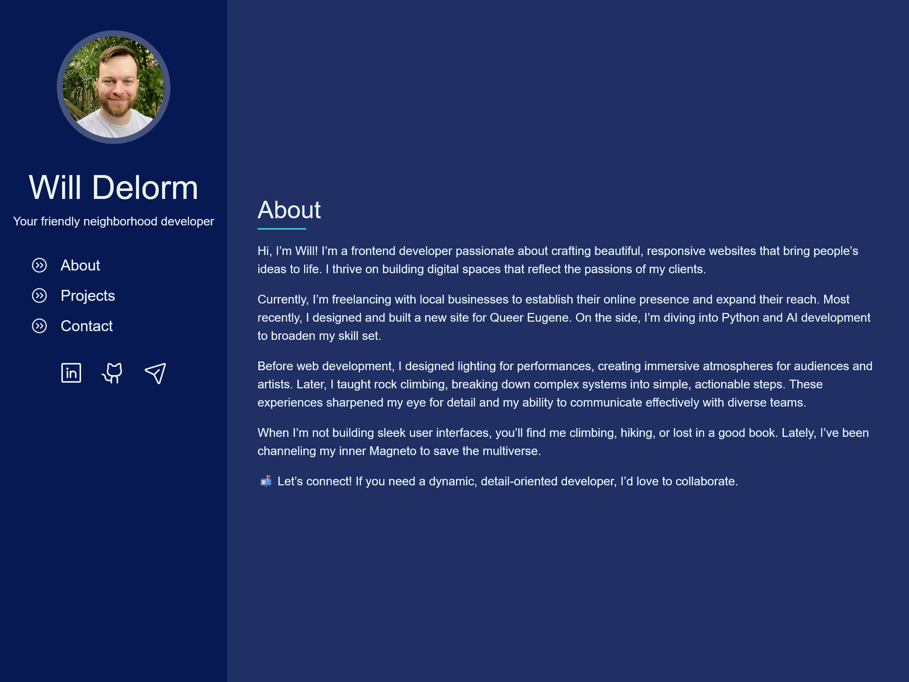

# Will Delorm's Portfolio

Welcome to the staging ground for Will Delorm's personal website.

## Project Overview

This project is a personal website to showcase my portfolio and other personal projects. It is built using React and TailwindCSS.



## Tech Stack

- [Vite](https://vite.dev/)
- [React](https://react.dev/)
- [TailwindCSS](https://tailwindcss.com/)
- [Motion](https://motion.dev/)
- [Vitest](https://vitest.dev/)

## Getting Started

To get a local copy up and running, follow these simple steps.

### Prerequisites

Make sure you have the following installed:

- Git
- Node
- A modern web browser

### Installation

1. Clone the repository:
    ```sh
    git clone https://github.com/willdelorm/willdelorm.github.io.git
    ```
2. In your terminal, navigate to the project folder and run `npm install`.
3. Once installed, run `npm run dev` to spin up a dev environment.
2. Navigate to `http://localhost:5173/` in your web browser to view the website.

## Usage

Feel free to explore the website and check out the different sections. If you find any issues or have suggestions, please open an issue on the repository.

## License

Distributed under the MIT License. See `LICENSE` for more information.

## Contact

Will Delorm - [will@willdelorm.com](mailto:will@willdelorm.com)

Project Link: [https://github.com/willdelorm/willdelorm.github.io](https://github.com/willdelorm/willdelorm.github.io)