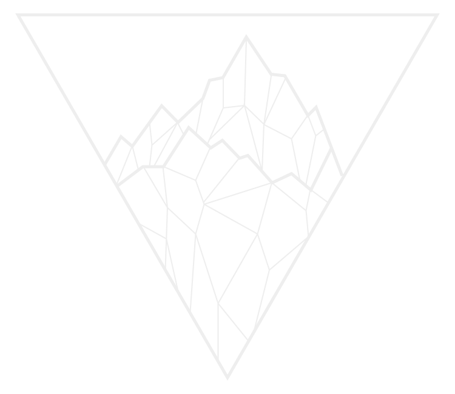

<!--
*** README Template created by othneildrew.
*** You can find their repo here:
*** https://github.com/othneildrew/Best-README-Template
-->

<!-- PROJECT SHIELDS -->

[![Contributors][contributors-shield]][contributors-url]
[![Forks][forks-shield]][forks-url]
[![Stargazers][stars-shield]][stars-url]
[![Issues][issues-shield]][issues-url]
[![MIT License][license-shield]][license-url]
[![LinkedIn][linkedin-shield]][linkedin-url]

<!-- PROJECT LOGO -->
 

  

<h3 align="center">My GitPages Site</h3>

  

    Staging ground for current and future projects
     
    <a href="https://github.com/willdelorm/willdelorm.github.io"><strong>Explore the docs »</strong></a>
     
     
    <a href="https://willdelorm.github.io">View Demo</a>
    ·
    <a href="https://github.com/willdelorm/willdelorm.github.io/issues">Report Bug</a>
    ·
    <a href="https://github.com/willdelorm/willdelorm.github.io/issues">Request Feature</a>
  

<!-- TABLE OF CONTENTS -->

  
Table of Contents

  <ol>
    <li>
      <a href="#about-the-project">About The Project</a>
      <ul>
        <li><a href="#built-with">Built With</a></li>
      </ul>
    </li>
    <li>
      <a href="#getting-started">Getting Started</a>
      <ul>
        <li><a href="#prerequisites">Prerequisites</a></li>
        <li><a href="#installation">Installation</a></li>
      </ul>
    </li>
    <li><a href="#usage">Usage</a></li>
    <li><a href="#roadmap">Roadmap</a></li>
    <li><a href="#contributing">Contributing</a></li>
    <li><a href="#license">License</a></li>
    <li><a href="#contact">Contact</a></li>
    <li><a href="#acknowledgments">Acknowledgments</a></li>
  </ol>

<!-- ABOUT THE PROJECT -->

## About The Project

[![Product Name Screen Shot][product-screenshot]](/assets/screenshot.png)

(<a href="#readme-top">back to top</a>)

### Built With

This project was created entirely in plain HTML / CSS / JavaScript.

(<a href="#readme-top">back to top</a>)

<!-- GETTING STARTED -->

## Getting Started

This project does not rely on any external dependencies or services.

Once downloaded, you may open the `index.html` file in your preferred browser or start a Live Server from your code editor.

(<a href="#readme-top">back to top</a>)

<!-- ROADMAP -->

## Roadmap

- [x] Add responsive styling for tablet/mobile devices
- [ ] Add READMEs/photos to each project
- [x] Include technologies used in project tiles
- [x] Add dev icons to projects
- [x] Add resume to About section

(<a href="#readme-top">back to top</a>)

<!-- CONTRIBUTING -->

## Contributing

Contributions are what make the open source community such an amazing place to learn, inspire, and create. Any contributions you make are **greatly appreciated**.

If you have a suggestion that would make this better, please fork the repo and create a pull request. You can also simply open an issue with the tag "enhancement".
Don't forget to give the project a star! Thanks again!

1. Fork the Project
2. Create your Feature Branch (`git checkout -b feature/AmazingFeature`)
3. Commit your Changes (`git commit -m 'Add some AmazingFeature'`)
4. Push to the Branch (`git push origin feature/AmazingFeature`)
5. Open a Pull Request

(<a href="#readme-top">back to top</a>)

<!-- LICENSE -->

## License

Distributed under the MIT License. See `LICENSE.txt` for more information.

(<a href="#readme-top">back to top</a>)

<!-- CONTACT -->

## Contact

Your Name - [@willdelorm](https://github.com/willdelorm) - willdelorm@gmail.com

Project Link: [https://github.com/willdelorm/willdelorm.github.io](https://github.com/willdelorm/willdelorm.github.io)

(<a href="#readme-top">back to top</a>)

<!-- ACKNOWLEDGMENTS -->

## Acknowledgments

- [FontAwesome](https://fontawesome.com/)
- [Google Fonts](https://fonts.google.com/)
- [Undraw Illustrations](https://undraw.co/illustrations)

(<a href="#readme-top">back to top</a>)

<!-- MARKDOWN LINKS & IMAGES -->
<!-- https://www.markdownguide.org/basic-syntax/#reference-style-links -->

[contributors-shield]: https://img.shields.io/github/contributors/willdelorm/willdelorm.github.io.svg?style=for-the-badge
[contributors-url]: https://github.com/willdelorm/willdelorm.github.io/graphs/contributors
[forks-shield]: https://img.shields.io/github/forks/willdelorm/willdelorm.github.io.svg?style=for-the-badge
[forks-url]: https://github.com/willdelorm/willdelorm.github.io/network/members
[stars-shield]: https://img.shields.io/github/stars/willdelorm/willdelorm.github.io.svg?style=for-the-badge
[stars-url]: https://github.com/willdelorm/willdelorm.github.io/stargazers
[issues-shield]: https://img.shields.io/github/issues/willdelorm/willdelorm.github.io.svg?style=for-the-badge
[issues-url]: https://github.com/willdelorm/willdelorm.github.io/issues
[license-shield]: https://img.shields.io/github/license/willdelorm/willdelorm.github.io.svg?style=for-the-badge
[license-url]: https://github.com/willdelorm/willdelorm.github.io/blob/main/LICENSE.txt
[linkedin-shield]: https://img.shields.io/badge/-LinkedIn-black.svg?style=for-the-badge&logo=linkedin&colorB=555
[linkedin-url]: https://linkedin.com/in/willdelorm
[product-screenshot]: assets/screenshot.png
